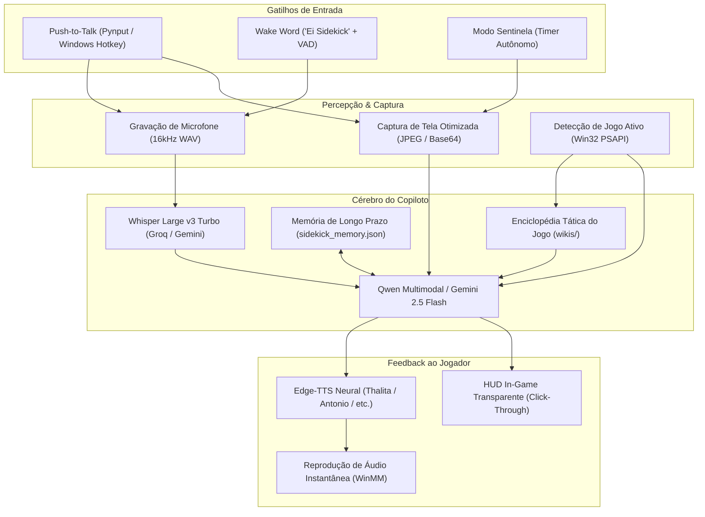

# 🎮 Sidekick — Seu Copiloto Gamer Universal com IA

<div align="center">

[](https://www.python.org/)
[](https://www.microsoft.com/windows/)
[](https://groq.com/)
[](https://github.com/rany2/edge-tts)
[](https://github.com/TomSchimansky/CustomTkinter)
[](LICENSE)

<p align="center">
  <strong>O copiloto de inteligência artificial de ultra-baixa latência que joga com você em qualquer jogo no PC.</strong><br>
  Visão multimodal da tela em tempo real, HUD transparente in-game, modo mãos livres, enciclopédia de wikis táticas e proteção nativa contra anti-cheat.
</p>

[Recursos](#-principais-recursos) •
[Instalação](#-instalação-rápida) •
[Como Usar](#-como-usar-durante-o-jogo) •
[Arquitetura](#-arquitetura-do-sistema) •
[Personalidades](#-5-arquétipos-de-personalidade) •
[Anti-Cheat & Stealth](#-segurança--modo-stealth-anti-cheat) •
[Configurações](#%EF%B8%8F-configuração-completa)

</div>

---

> *"Bora jogar! Tô na chamada do Discord assistindo sua gameplay. Qualquer dúvida de build, rota ou boss, só apertar a tecla que eu dou a call!"*

O **Sidekick** é um assistente autônomo desenhado para rodar silenciosamente em segundo plano enquanto você joga **qualquer jogo** (Dark Souls, Elden Ring, Albion Online, Hollow Knight, Dead Cells, shooters, RPGs, etc.). Ele se comporta como uma parceira de chamada no Discord: descontraída, com zoeira saudável nas mortes bobas, elogios sinceros nas boas jogadas e calls táticas cirúrgicas para te ajudar a vencer.

---

## ⚡ 0% de Impacto na Performance do seu PC

* **0% de impacto na sua GPU:** Seus gigabytes de VRAM permanecem 100% dedicados a manter os frames do jogo estáveis.
* **0% de lag na CPU:** Inferência em nuvem de altíssima velocidade (Groq LPU / Gemini Flash) e síntese de voz assíncrona, deixando o processador focado no jogo.
* **Zero Bordões Forçados:** Linguagem natural, concisa (2 a 4 frases faladas) e sem slogans engessados repetidos a cada resposta.

---

## 🌟 Principais Recursos

### 1. 🎙️ Push-to-Talk + Modo Mãos Livres (Wake Word)
- **Push-to-Talk Instantâneo:** Segure a tecla de atalho configurada (`Caps Lock`, `F1-F12` ou botões laterais do mouse) para falar.
- **Wake Word ("Ei Sidekick"):** Ative o microfone sem as mãos! Fale *"Ei Sidekick, onde dropa ferro?"* ou apenas *"Ei Sidekick!"* para abrir uma janela de escuta inteligente.

### 2. 🖥️ HUD Overlay In-Game Transparente (Click-Through)
- Overlay flutuante translúcido posicionado no canto da tela (`top_right` ou `bottom_center`).
- **100% Click-Through via Win32 API:** O mouse e teclado atravessam o overlay diretamente para o jogo — você nunca perde o foco da partida.
- Exibe legendas das respostas em tempo real, status de raciocínio e alertas de perigo.

### 3. 🚨 Modo Sentinela Autônomo (Vigia Silenciosa)
- Vigia sua tela periodicamente a cada 25s em **silêncio absoluto**.
- **Filtro de Silêncio Estrito:** Ela só se pronuncia se detectar situações críticas:
  1. *Vida Crítica:* Barra de HP abaixo de 25% em perigo.
  2. *Morte Iminente:* Telas de "YOU DIED" ou derrota.
  3. *Emboscada:* Inimigo pelas costas ou escondido no teto.
  4. *Baú / Item Secreto:* Loot raro visível que você não viu.

### 4. 📚 Enciclopédia de Wikis Táticas Pré-Instaladas e Dinâmicas
- O Sidekick detecta automaticamente qual jogo está rodando no Windows.
- Carrega guias com fraquezas de chefes, builds meta e mecânicas (Dark Souls, Elden Ring, Albion Online, Hollow Knight, Dead Cells, Celeste, Children of Morta, etc.).
- **Auto-Compilação via IA:** Se você abrir um jogo inédito, o motor compila um guia tático completo em segundo plano e salva na pasta `wikis/`.

### 5. 💾 Memória Persistente de Longo Prazo e Obediência a Regras
- Lembra das suas armas equipadas, bosses já derrotados e estilo de jogo entre diferentes sessões (`sidekick_memory.json`).
- **Comandos Mandatórios:** Diga *"Sidekick, não fala sobre vida"* ou *"Sempre avisa quando ver um baú"*; ela memoriza a regra imediatamente e a obedece para sempre.

### 6. 🛡️ Proteção Anti-Cheat & Modo Stealth Automático
- Suporte a **Windows API RegisterHotKey** (evita hooks globais detectáveis por anti-cheats).
- Detecta jogos competitivos com anti-cheat rigoroso (Valorant, CS2, LoL, Albion, PoE, GTA V, etc.) e ativa automaticamente o **Modo Stealth** (desliga captura de tela e Sentinela para 100% de segurança).

### 7. 🎛️ Interface Gráfica Moderna (CustomTkinter)
- Painel em tempo real com indicador de status, métricas de hardware, console de logs e abas completas de configuração (atalhos, vozes neurais, sensibilidade de microfone e personalidades).

---

## 🧠 5 Arquétipos de Personalidade

Você pode alternar o estilo de jogo da sua copiloto com 1 clique pela GUI ou pelo `config.json`:

| Personalidade | Nome no App | Estilo de Comunicação | Voz Recomendada |
| :--- | :--- | :--- | :--- |
| `parceira` | **🎮 Amiga Gamer** | Descontraída, linguagem gamer natural, zoeira leve nas mortes e calls inteligentes. | `pt-BR-ThalitaMultilingualNeural` |
| `coach` | **🏆 Coach Tático** | Tryhard, focado em alta performance, leitura de mapa, posicionamento e cooldowns. | `pt-BR-AntonioNeural` |
| `zoeiro` | **🔥 Troll Zoador** | Sarcasmo e zoeira quando você faz besteira, mas explicando como resolver. | `pt-BR-AntonioNeural` |
| `zen` | **🧘 Guia Zen** | Super calma, acolhedora e focada em evitar o tilt em chefes difíceis de Soulslike. | `pt-BR-FranciscaNeural` |
| `narrador` | **⚔️ Narrador Épico** | Mestre de RPG medieval, transformando sua gameplay em uma crônica lendária. | `pt-BR-NicolauNeural` |

---

## 🏗️ Arquitetura do Sistema



---

## 🚀 Instalação Rápida

### Pré-requisitos
* **Sistema Operacional:** Windows 10 ou 11 (64-bit)
* **Python:** 3.10 ou superior
* **Chave Gratuita de API:** [Groq Cloud](https://console.groq.com/) *(recomendada)* ou [Google AI Studio (Gemini)](https://aistudio.google.com/)

### 1. Clonar o Repositório
```powershell
git clone https://github.com/EduBraga7/sidekick.git
cd sidekick
```

### 2. Criar e Ativar Ambiente Virtual
```powershell
python -m venv venv
.\venv\Scripts\Activate.ps1
```

### 3. Instalar Dependências
```powershell
pip install -r requirements.txt
```

### 4. Configurar Chaves de API
Copie o template de ambiente seguro:
```powershell
Copy-Item .env.example .env
```
Abra o arquivo `.env` e adicione sua chave de API gratuita:
```env
GROQ_API_KEY=gsk_sua_chave_aqui
# Opcional (se quiser usar Gemini Flash):
# GEMINI_API_KEY=sua_chave_gemini_aqui
```

> 🔒 **Aviso de Segurança:** O arquivo `.env` está no `.gitignore` e **nunca** é enviado ao GitHub.

---

## 🎮 Como Iniciar e Usar

### Modo 1: Interface Gráfica Moderna (Recomendado - Padrão)
```powershell
python main.py
```
*Abre a janela moderna com abas de configurações, logs em tempo real e controle de serviços.*

### Modo 2: Linha de Comando (Console / Headless)
```powershell
python main.py --cli
```

### Modo 3: Atalho Rápido (.bat)
Dê um duplo clique no arquivo `Iniciar_Sidekick.bat` na raiz do projeto.

---

## 🎯 Como Jogar com a Sidekick

1. Abra qualquer jogo (ex: **Dark Souls**, **Albion Online**, **Elden Ring**, etc.).
2. **Segure o atalho** (por padrão `Caps Lock` ou botão lateral do mouse `mouse_x1`).
3. Ouça o bipe sonoro sutil.
4. Fale naturalmente:
   - *"Sidekick, vale a pena usar essa arma aqui?"*
   - *"Qual é a fraqueza desse chefe?"*
   - *"Onde eu refino esse minério em Albion?"*
5. **Solte a tecla:** ela responderá diretamente no seu fone de ouvido em ~1 segundo, exibindo a legenda no HUD transparente sobre o jogo!
6. **Calar voz:** toque no atalho a qualquer momento para interromper a fala imediatamente.

---

## 🛡️ Segurança & Modo Stealth Anti-Cheat

Para jogos com sistemas anti-cheat agressivos em nível de kernel (Vanguard, Easy Anti-Cheat, BattlEye, Ricochet):

1. Ative `"anti_cheat_protection": true` e `"input_method": "windows_hotkey"` no `config.json`.
2. O Sidekick substitui hooks globais pelo registro nativo da API do Windows (`RegisterHotKey`).
3. Quando um jogo monitorado for detectado:
   - A captura de tela no Push-to-Talk é desativada.
   - O Modo Sentinela é pausado automaticamente.
   - O ícone na barra de tarefas muda para o estado **Stealth (Laranja/Alerta)**.

Consulte o guia completo em [SETUP_SEGURO.md](SETUP_SEGURO.md).

---

## ⚙️ Configuração Completa (`config.json`)

```json
{
  "push_to_talk_key": "caps_lock",
  "preferred_provider": "groq",
  "groq_api_key": "",
  "gemini_api_key": "",
  "voice": "pt-BR-ThalitaMultilingualNeural",
  "voice_rate": "+5%",
  "voice_pitch": "+0Hz",
  "play_chimes": true,
  "chime_volume": 0.2,
  "game_profile": "universal",
  "enable_screen_vision": true,
  "sentinel_mode_enabled": true,
  "sentinel_interval_seconds": 25,
  "anti_cheat_protection": false,
  "input_method": "pynput",
  "enable_overlay": true,
  "overlay_position": "top_right",
  "enable_wake_word": false,
  "wake_word_sensitivity": "media",
  "personality": "parceira"
}
```

---

## 📦 Gerar Executável Portátil (.exe)

Você pode compilar o Sidekick em um executável autônomo de 1 arquivo:

```powershell
python scripts/build_exe.py
```

O binário final será gerado em: `dist/Sidekick.exe`.

---

## 🧪 Testes Automatizados

Para executar toda a suíte de testes de integração e componentes:

```powershell
python tests/test_sidekick.py
```

```
Ran 17 tests in 1.5s
OK
[OK] Configuração validada
[OK] Bipes sonoros funcionando
[OK] Prompt universal validado
[OK] Memória persistida e limites respeitados
[OK] HUD Overlay testado com sucesso
[OK] Detector de Wake Word validado
[OK] 5 Personalidades validadas
```

---

## 🤝 Contribuição

Contribuições são muito bem-vindas! Sinta-se livre para abrir uma **Issue** ou submeter um **Pull Request**.

1. Faça um Fork do projeto
2. Crie uma Branch para sua feature (`git checkout -b feature/NovaFeature`)
3. Faça commit das mudanças (`git commit -m 'feat: adiciona nova funcionalidade'`)
4. Envie para a Branch (`git push origin feature/NovaFeature`)
5. Abra um Pull Request

---

## 📄 Licença

Distribuído sob a licença **MIT**. Veja `LICENSE` para mais informações.
